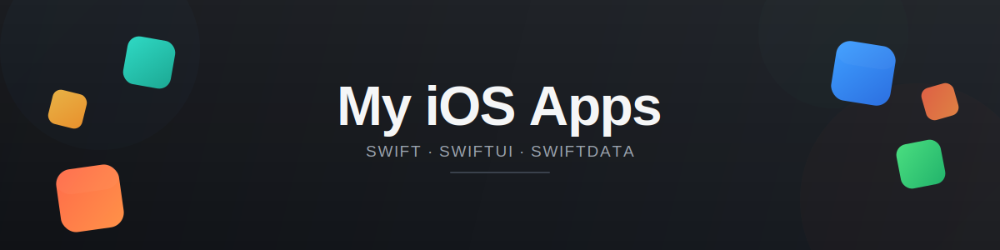

A collection of iOS apps I've built — spanning productivity, dev tools, and personal projects.

### [SarsMaat](https://willfrost.co.za/projects/sarsmaat)

An educational app that makes South African taxes feel easier to understand — SARS brackets, medical credits, and deductions.

### [TicketMe](https://willfrost.co.za/projects/ticketme)

Movie ticket app with Apple Wallet integration.

### [FormuNote](https://willfrost.co.za/projects/formunote)

The ultimate note-taking companion for engineering and math students.

### [PatchUp](https://willfrost.co.za/projects/patchup)

A simple and beautiful app to track game patch notes.

### [Versely](https://willfrost.co.za/projects/versely)

A beautiful Bible app for systematic Scripture reading via notifications.

### [DummyData](https://willfrost.co.za/projects/dummydata)

Developer tool for generating realistic test data with one click.

### [AirCrafty](https://willfrost.co.za/projects/aircrafty)

Manage your plane's maintenance and repairs.

### [Boulder Climber](https://willfrost.co.za/projects/boulderclimber)

Become a boulder and climb some big hills!

### [OpenGraph](https://willfrost.co.za/projects/opengraph)

A lightweight app for previewing OpenGraph URLs locally on your machine.

---

## Archived

### [CueTask](https://willfrost.co.za/projects-archive/cuetask)

A local LLM on your Mac that turns meeting notes into actionable tasks.

---

*Built with Swift and other Apple platforms and tools. More at [willfrost.co.za](https://willfrost.co.za)*
